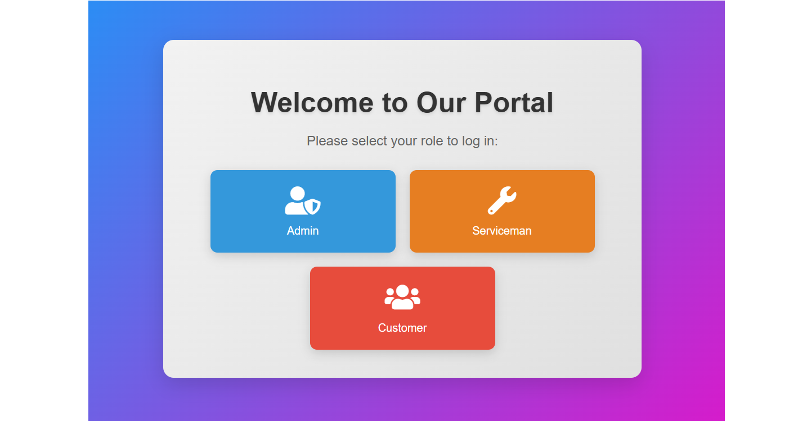
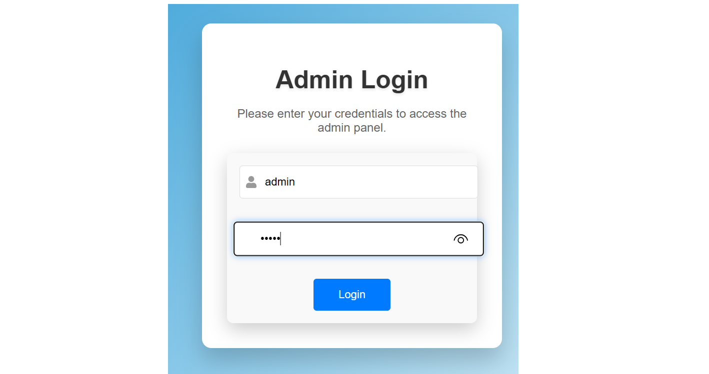
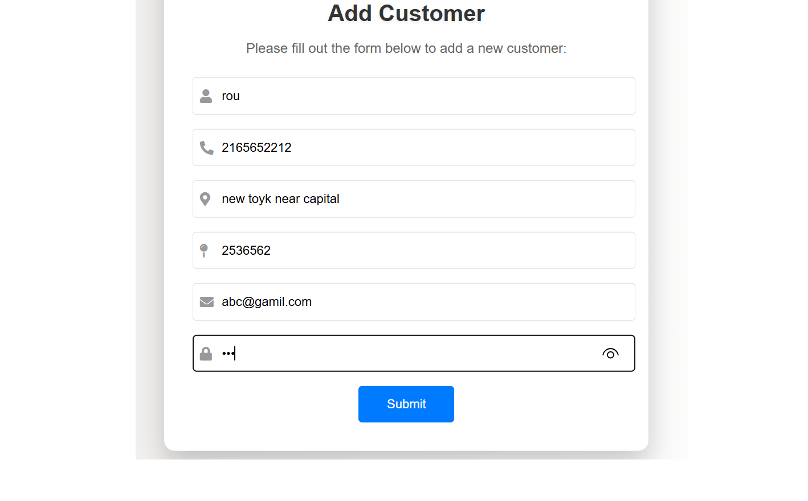
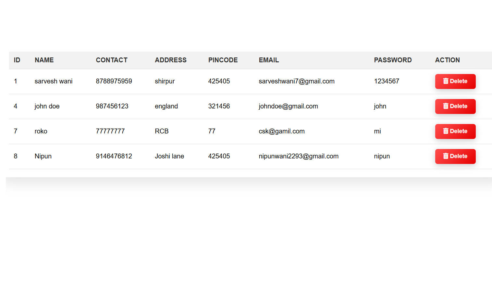
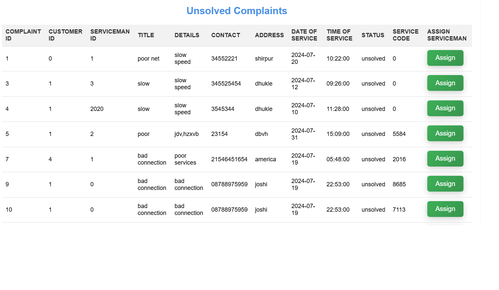
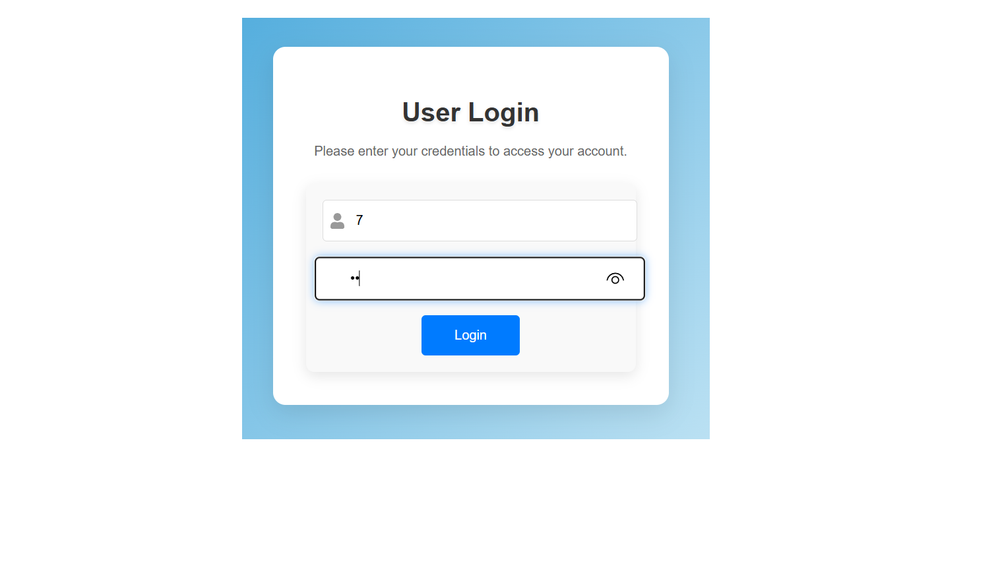
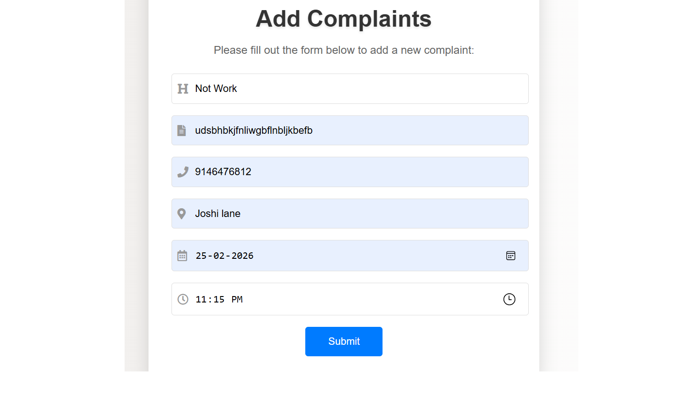
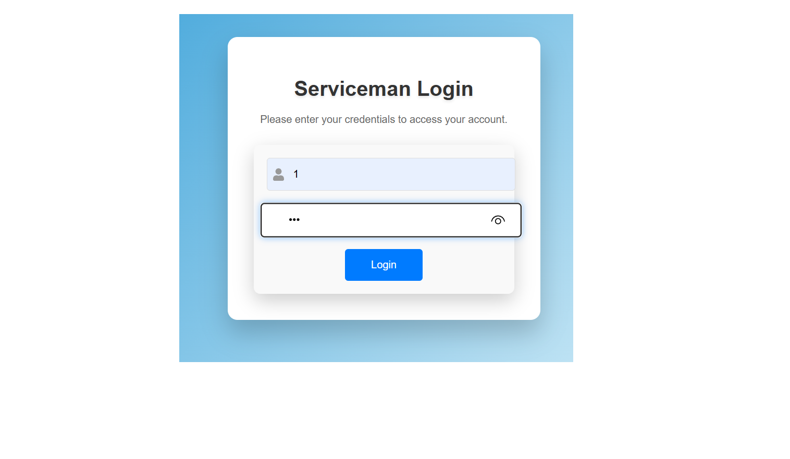
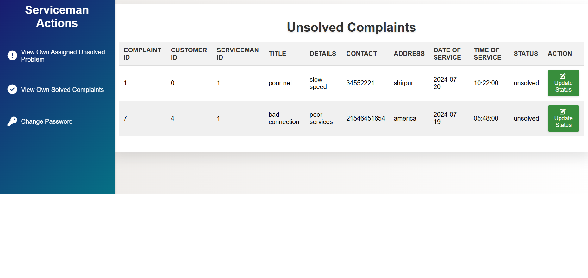
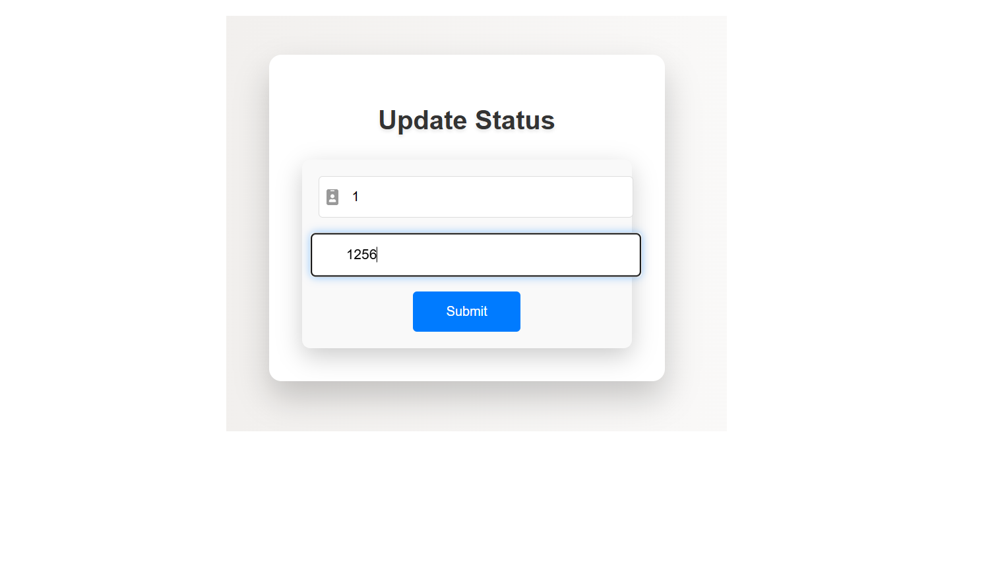

# 🌐 Internet Service Operations Portal

A full-stack web application developed for **Internet Service Providers (ISPs)** to streamline customer management, complaint handling, and service operations. The system enables administrators to register customers, manage service requests, assign complaints to service personnel, and track complaint resolution through a centralized platform.

---

## 📌 Project Overview

The Internet Service Operations Portal simplifies the day-to-day operations of an Internet Service Provider by providing an integrated platform for customer registration, complaint management, and service request tracking. It reduces manual effort, improves response time, and enhances the overall customer support process.

---

## ✨ Features

- 🔐 Secure Admin Authentication
- 👥 Customer Registration & Management
- 📝 Complaint Registration
- 👨‍🔧 Service Personnel Management
- 🔄 Complaint Assignment & Status Tracking
- 📋 View Customer Records
- 📄 View Complaint Records
- 💾 MySQL Database Integration using JDBC
- 🌐 Dynamic Web Application using Servlets and JSP

---

## 🛠️ Tech Stack

### Backend
- Java
- Servlets
- JSP
- JDBC

### Frontend
- HTML
- CSS
- JavaScript

### Database
- MySQL

### Server
- Apache Tomcat

### Development Tools
- Eclipse IDE
- MySQL Workbench

---

## 📂 Project Structure

```text
Internet-Service-Operations-Portal
│
├── src
│   ├── controller
│   ├── dao
│   ├── model
│   └── utility
│
├── WebContent
│   ├── css
│   ├── js
│   ├── images
│   └── jsp
│
├── database.sql
└── README.md
```

---

## ⚙️ Installation & Setup

### Prerequisites

- Java JDK 8 or later
- Apache Tomcat
- MySQL Server
- Eclipse IDE (Recommended)

### Steps to Run

1. Clone the repository

```bash
git clone https://github.com/your-username/internet-service-operations-portal.git
```

2. Import the project into Eclipse.

3. Create the MySQL database using the provided SQL script.

4. Configure the database connection in the JDBC utility class.

5. Deploy the project on Apache Tomcat.

6. Start the server and access the application through your browser.

---

## 📷 Application Screenshots

### Login Page



---

### Admin Dashboard



---

### Customer Registration



---

### Complaint Registration



---

### Complaint Management



---

### Complaint Status Tracking



---

### Service Personnel Management



---

### Customer Records



---

### Complaint Records



---

### Database Overview



---

## 🎯 Key Learning Outcomes

- Developed a dynamic web application using Java Servlets and JSP.
- Implemented CRUD operations using JDBC and MySQL.
- Applied the MVC (Model-View-Controller) architecture.
- Implemented session-based authentication and authorization.
- Designed and managed a relational database.
- Improved understanding of enterprise Java web application development.

---

## 🚀 Future Enhancements

- Spring Boot Migration
- Spring Security Integration
- REST API Support
- Email Notifications
- Dashboard Analytics
- Role-Based Access Control
- JWT Authentication

---

## 👨‍💻 Author

**Nipun Wani**

GitHub: https://github.com/Nipun-wani
